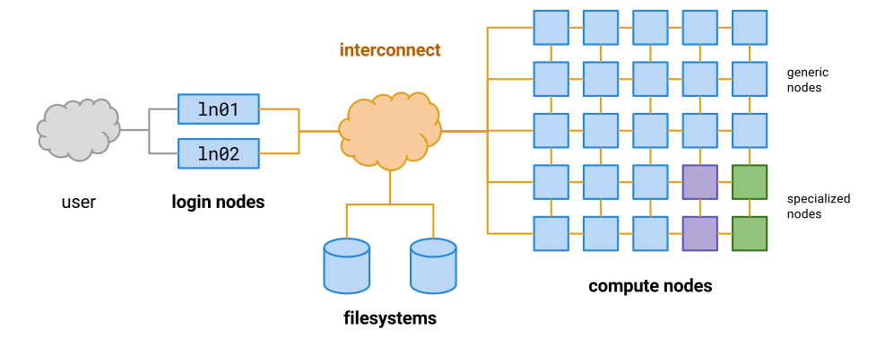

# Quick-start Sherlock/Slurm essentials
Created Dec 2018 by Alex Chu. Last Updated: 181226 AEC  

Sherlock is the primary high performance computing (HPC) cluster at Stanford that most people use for computational work that requires more resources than are available on the average laptop or desktop. We'll give the basics on getting started on Sherlock as it pertains to working in our group, but the Sherlock staff have put together some [really excellent quick-start tutorials](https://www.sherlock.stanford.edu/docs/getting-started/prerequisites/) and [specs/resources](https://www.sherlock.stanford.edu/docs/overview/introduction/) that you should take a look at. If you aren't yet familiar with Linux and the command line, you should check out [this tutorial](https://ryanstutorials.net/linuxtutorial/) first, as almost all of Sherlock is accessed by command line.  



As seen in the figure, Sherlock is a cluster of nodes, and each node has a number of CPUs. (You can think of a node as a really powerful computer.) Each CPU can execute a single "thread" of programs and instructions, for example running a single trajectory in Rosetta. There are four login nodes; when you log in to Sherlock, your command line will be run on one of these nodes. From here you can access the data stored in the filesystems, or submit jobs to the compute nodes, where the heavy lifting is done.  

## How to use Slurm to launch jobs on Sherlock
You log in to Sherlock using secure shell `ssh [SUNet ID]@login.sherlock.stanford.edu` and log off with `exit`. If you want to eliminate the need to authenticate repeatedly in a short time span, you can set up your ssh config as described on [this page](https://www.sherlock.stanford.edu/docs/advanced-topics/connection/).  

In general, don't do computationally heavy work on login nodes (long Rosetta runs, moving large quantities of data, anything that holds up the command line for too long). This slows down the login node for everyone else on Sherlock. Instead, use the compute nodes - but how? The **Slurm** workload manager allows you to run simple Linux/Python commands on the compute nodes. A more detailed Slurm tutorial can be found [here](https://support.ceci-hpc.be/doc/_contents/QuickStart/SubmittingJobs/SlurmTutorial.html), or go straight to the docs, but here are some of the most basic commands to get you started.  
- `sdev` gets you into a developer's node, which is basically a command line where it's okay to do computation. The default lasts for 1 hour; you can pass arguments to request more time or memory.
- `salloc` requests, or allocates, resources for you on Sherlock. You can then look up which node/CPU you've been granted using `squeue` (see below) and then `ssh` into that node (e.g. `ssh sh-101-17`).
- `sbatch [filename.sbatch]` submits a job to the Sherlock job scheduler **and is what you will probably use the most**. An example of an bash script to be used as an sbatch file is given below, with some of the common arguments you might supply to it. 
- `squeue -u [SUNet ID]` will let you see the status of your jobs. Another common argument is `-p possu` to see  jobs running on the partition.  
- `scancel [job ID]` lets you cancel a job from the slurm queue (replace job ID with the Job ID listed from `squeue`.)

You can also run Jupyter notebooks on Sherlock by port-forwarding the notebook interface to a browser on your computer. Vanessa Sochat and Raphael Townshend have set up a good resource on how to do this: [https://github.com/vsoch/forward].  

```
#!/bin/bash 
# The preceding line is the shebang. It indicates what should execute the 
# commands in this file. In this case, the commands in this file are bash
# Linux commands. You can also replace it with #!/bin/usr/python, for example,
# to put python code in this file instead of bash commands.

# Slurm directives are given by #SBATCH. You can comment them out by putting
# an extra hash. While we've included most useful Slurm arguments in this
# file, only the most common or essential are not commented out. This file is 
# ready to use immediately as your sbatch file.

# This lets you name your Slurm job.
#SBATCH --job-name=myjob

# Have SLURM send you an email when the job ends or fails, or some other event
# (see man sbatch for more). Be careful - it could end up in your spam, or if
# you submit hundreds of jobs at once, you could get hundreds of emails.
##SBATCH --mail-type=FAIL
##SBATCH --mail-user=jdoe@stanford.edu

# Where to write your job stdout. You can add the job ID with %j, or the job
# and array with %A and %a. The default is `--output=slurm-%j.out`.
##SBATCH --output=my_output_%j.out

# Where to write your job stderr.
##SBATCH --error=my_score_%j.err

# This lets you define a job array - basically, your script is run 200 times,
# capped at fifty running at any one time. You can remove the `%50` to remove
# the cap and run all your jobs ASAP.
##SBATCH --array=0-199%50

# The quality of service, which is somewhat like job priority or importance.
# Set to `--qos=high_p` if the job is urgent
# Set to `--qos=long` if you are requesting more than 48 hours for your job
##SBATCH --qos=normal

# The walltime or total compute time you request. The format can be
# dd-hh:mm:ss, hh:mm:ss, mm:ss, or mm. The default is 2:00:00 (2 hours)
#SBATCH --time=01:00:00

# Which partitions you want to submit your jobs to.
#SBATCH -p owners,possu

# The number of tasks in this script.
#SBATCH --ntasks=1

# The number of nodes you want to request.
#SBATCH --nodes=1

# How much memory (in MB) to request per CPU. The default is 4000 MB.
##SBATCH --mem-per-cpu=8000


# Everything that is not commented in this file will be run by Sherlock.

# An example Rosetta command with arguments
# remodel.linuxgccrelease -s half_retim18.pdb -blueprint halftim_disulf.bp -remodel::build_disulf -remodel::max_rt_limit 0.4

# Here, the @flags means that all the arguments are written in `flags` file.
srun remodel.linuxgccrelease @flags
```

## Filesystems and file transfer between Sherlock and your local machine
The Sherlock filesystem can seem easy to get lost in at first sight. The main drives that you will spend most of your time on are `/home/` and `/scratch/`.
- `/home/users/[SUNet ID]/` is your home directory. This is where `~/` points to, where your bash profile lives, and where you can keep most of your storage and files.
- `/scratch/users/[SUNet ID]/` is your scratch directory (like scratch paper). Your `$SCRATCH` variable points here, and this is where you should do most of your work, because read/write speeds are much faster on this drive than on the home directory. However, Sherlock automatically archives files on scratch that are older than 6 months, so you'll have to either `touch` your files to keep them updated, or port them over to your home directory to hold on to them.  
- `/scratch/PI/possu/` is our group scratch directory. It's easy to keep things here that the group uses, or that you want to share with the group. We also usually build Rosetta here, which means it occasionally gets archived by the Sherlock scratch gobbler (and needs to be rebuilt).

At some point, you will want to move files between Sherlock and your local machine. There are two main ways for doing this:
- `scp` - This is the simplest and fastest for single files. You can use the `scp` Linux command in the same way you would use the `cp` command, except you will need to authenticate. The syntax would be `scp [SUNet ID]@login.sherlock.stanford.edu:[/path/to/file] [/path/to/save]`, and you can also copy from your local machine to Sherlock by switching the order of the two arguments.  
- `sshfs` aka OSXFUSE. This is the most convenient, as it allows you to manage the filesystem on Sherlock as if it were just in a directory on your local machine, but can sometimes be slow. You can [download it here](https://osxfuse.github.io/) and once it's installed, you can "mount" any of your Sherlock directories on your local computer with `sshfs [sunetid]@login.sherlock.stanford.edu:[/path/to/Sherlock/dir/] [/path/to/local/dir/]`. Detailed instructions for setup are [here](https://www.sherlock.stanford.edu/docs/storage/data-transfer/#sshfs). When you finish, be sure to unmount your drive with `unmount -f [/path/to/local/dir/]`. If you don't do this, sshfs will sometimes try to reconnect automatically after sleeping without credentials, and its repeated failed attempts may result in your IP address being temporarily blocked from logging in.  

In general, an excellent resource is the [Sherlock reference](https://www.sherlock.stanford.edu/docs/storage/data-transfer/) for data transfer.  

## What are partitions?
Sherlock is free to use for anyone with a Stanford affiliation, but it can be hard to get enough resources this way if you're doing a lot of computation. Most groups that do computationally intensive work become "owners," which means they purchase additional, dedicated nodes on Sherlock. When groups do this, they get access to "partitions," or specific collections of nodes, on Sherlock. As far as computational resources available to us in this lab, we belong to the "possu" group and have access to the following partitions on Sherlock:  
- `normal` - the general partition that any Stanford affiliate can use. It can be hard to get computing time on this partition.
- `owners` - a collection of nodes available to all owners. When other owners aren't using their nodes, we can use their resources, but these jobs are automatically killed and restarted later when the original owners want to use their resources.
- `possu` - five nodes that our lab owns, (sh-101, sh-102, TODO), each with 20 CPUs
- `bioe` - five nodes of A40 40G GPUs (4 GPUs per node, except for node 16, which has 5 GPUs). These are shared by other Stanford Bioengineering labs
- Other partitions you might encounter
  - `iric` - the SLAC partition that only Possu has personal access to.
  - `bigmem` - use when you need >64gb RAM
  - `dev` - a partition of 65 GPUs, each available for up to 2 hours. These are particularly good for interactive sessions, as the GPUs are a bit slower and time is limited. This partition is shared by all of Sherlock users.
  - `gpu` - GPUs available to all of Sherlock users, these are hard to obtain access to though, wait time can be long.

To view what resources are available at any given time, simply run `sh_part` in the Terminal window. This will let you know what nodes, GPUs, CPUs etc. are available, in queue, and in use. This can be useful for planning which partition to submit a job to as well.

These are listed in descending order of how many people share the partition, and therefore ascending order of how easy it is to get computing time. Ideally, it is best to first try to submit jobs to partitions near the top of the list, but if it is hard to get jobs running, then you can move further and further down the list. We do most of our work on the `possu` and `owners` partitions.  

## How to use scientific Python packages
There are a few different ways to get Python packages on Sherlock (e.g. `numpy`, `pandas`, etc.). Sherlock provides many common packages as modules which you can easily load and use with a single command; [here is the guide](https://www.sherlock.stanford.edu/docs/software/modules/).  

Additionally, since loading modules can have unexpected effects on your environment, we have also made some group installations of common packages in python2.7. This is an ongoing process and feel free to ask lab members about more details, but for now, in order to use these installations, add these lines to your bash profile (~/.bash_profile):  
```
export PATH=$PATH:$GROUP_HOME/python/bin
export PYTHONPATH=$GROUP_HOME/python/lib/python2.7/site-packages:$PYTHONPATH
```

We have a shared lab miniconda in our $GROUP_HOME. We encouage you to build your enviornments in this miniconda, as it will save time and storage space. In addition, it allows our computational side of the lab to be more collaborative and efficient. Feel free to ask lab members for more details.

To install a python2.7 package, use these commands:
```
$ ml python/2.7.13
$ PYTHONUSERBASE=$GROUP_HOME/python pip install --user [packagename]
```

## Other Computing Resources
TODO Building Rosetta on your own machine. Other computing resources include Xstream (more GPUs). XSEDE (NSF). Ebisu. Cloud. Scratch vs home.

## FAQs
TODO  
